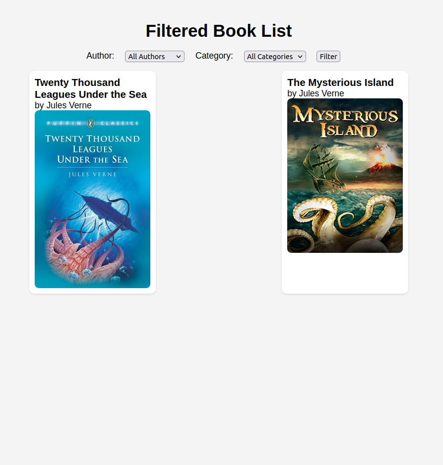

# Django Bookstore Project

Welcome to the Django Bookstore project! This project is a simple Django application for managing a bookstore. It allows users to view a list of books, see details of each book, and navigate through pages of books.

## Project Structure

The project consists of the following components:

- **Models**: Defines the data structure of the application. Currently, there is a single model `Book` that represents a book in the bookstore.

- **Views**: Contains the logic to handle HTTP requests and generate responses. There are two views:
  - `view_of_books`: Displays a paginated list of all books available in the bookstore.
  - `view_of_one_book`: Displays the details of a specific book.

- **Templates**: Contains HTML templates for rendering the user interface. There are two templates:
  - `all_books.html`: Displays the list of books with pagination.
  - `one_book.html`: Displays the details of a single book.

## How to Run the Project

To run the project locally, follow these steps:

1. Clone the repository to your local machine:

    ```bash
    git clone https://github.com/your-username/django-bookstore.git
    ```

2. Navigate to the project directory:

    ```bash
    cd django-bookstore
    ```

3. Install the project dependencies (make sure you have Python and pip installed):

    ```bash
    pip install -r requirements.txt
    ```

4. Apply database migrations:

    ```bash
    python manage.py migrate
    ```

5. Run the development server:

    ```bash
    python manage.py runserver
    ```

6. Open your web browser and go to `http://127.0.0.1:8000/market/books/` to view the list of books.

## Screenshots

### All books
All presented books

Books with specific author


## Technologies Used

- Django: Web framework for building the application.
- Python: Programming language used for backend development.
- HTML/CSS: Frontend markup and styling.
